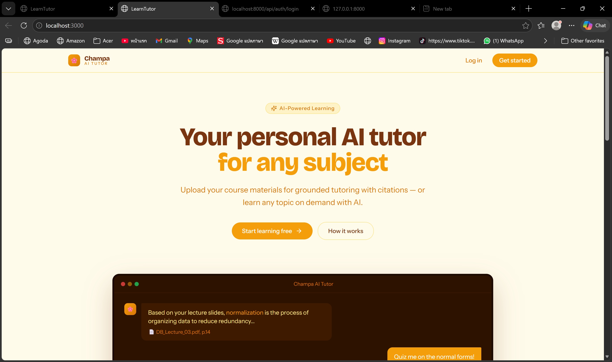
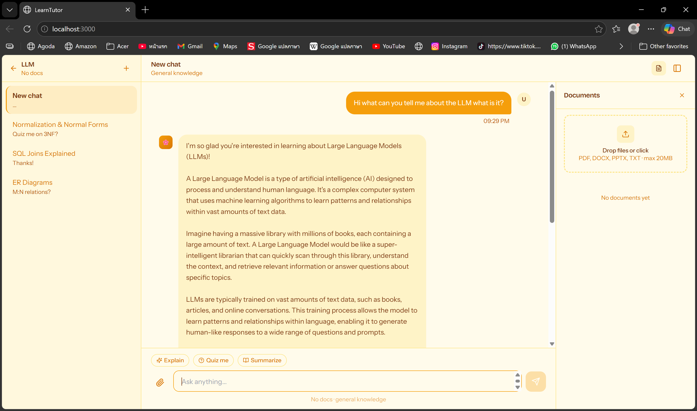

# AI Personalized Learning Tutor

An AI-powered web application that helps students study from their own course materials. Upload your lecture slides, PDFs, or notes, and the tutor explains the content directly from those documents — with citations pointing back to the exact source.

This project was developed as a Bachelor's thesis at Eszterházy Károly Catholic University in Eger, Hungary.

---

## Preview



*Student dashboard showing notebooks organized by course or topic.*



*Chat interface in Upload Mode with source citations from the uploaded document.*

---

## What This Project Does

Most AI tutors give generic answers based on whatever the chatbot was trained on. This project does something different: it teaches you from your own materials.

There are two ways to use it:

**Upload Mode** — You upload your study files (PDF, DOCX, PPTX, or TXT). The tutor reads them, indexes the content, and answers your questions based on what's actually in those documents. Every answer includes citations so you can verify where the information came from.

**Free Learning Mode** — If you just want to learn about a topic without uploading anything, you can type the topic and the tutor will explain it using its general knowledge. No documents required.

Both modes also support quizzes, conversation history, and feedback on your answers.

---

## Main Features

- Upload course materials and ask questions about them
- Get answers with source citations (document name and page number)
- Generate practice quizzes from your uploaded content
- Receive constructive feedback on quiz answers
- Save and revisit past conversations per notebook
- Switch between document-based learning and open topic learning

---

## Technologies Used

**Frontend**
- React (user interface)
- Tailwind CSS (styling)

**Backend**
- Python 3.12
- FastAPI (web framework)
- Motor (async MongoDB driver)

**AI Components**
- Llama 3.2 via Ollama (the language model, runs locally on your machine)
- Sentence Transformers with the all-MiniLM-L6-v2 model (for converting text to vectors)
- FAISS (for fast similarity search)
- CrewAI (for organizing the multi-agent system)

**Databases**
- MongoDB Atlas (stores users, notebooks, and conversations)
- FAISS (stores document embeddings, one index per notebook)

---

## How to Run It Locally

### Before You Start

You'll need these installed on your computer:

- Python 3.12 or newer
- Node.js 18 or newer
- A free MongoDB Atlas account (https://www.mongodb.com/cloud/atlas)
- Ollama installed locally (https://ollama.com)

### Step 1 — Set Up the Backend

Open a terminal and navigate to the backend folder:

```bash
cd backend/learn-tutor-backend
```

Create a virtual environment (this keeps the project's dependencies separate from your system Python):

```bash
python -m venv venv
```

Activate it. On Windows:

```bash
venv\Scripts\activate
```

On Mac or Linux:

```bash
source venv/bin/activate
```

Install the required packages:

```bash
pip install -r requirements.txt
```

Create a file named `.env` inside `backend/learn-tutor-backend/` and add your MongoDB connection details:

```
MONGO_URI=your_mongodb_connection_string_here
JWT_SECRET=any_random_secret_string_here
```

Start Ollama and download the language model (only needed once):

```bash
ollama serve
ollama pull llama3.2
```

Now run the backend server:

```bash
uvicorn app.main:app --reload
```

The backend should now be running at `http://localhost:8000`. You can also visit `http://localhost:8000/docs` to see all available API endpoints.

### Step 2 — Set Up the Frontend

Open a new terminal and go to the frontend folder:

```bash
cd frontend
```

Install the required packages:

```bash
npm install
```

Start the development server:

```bash
npm start
```

The application will open in your browser at `http://localhost:3000`.

---

## Project Structure

```
learn-tutor/
├── backend/
│   └── learn-tutor-backend/
│       ├── app/
│       │   ├── main.py            Entry point for the API
│       │   ├── rag.py             Document processing and retrieval
│       │   ├── Agents.py          Multi-agent logic (explainer, quiz, feedback)
│       │   ├── database.py        MongoDB connection setup
│       │   └── routes/            API endpoint handlers
│       └── requirements.txt
├── frontend/
│   ├── src/
│   │   ├── App.jsx                Main React component
│   │   └── components/            All page components
│   └── package.json
├── docs/
│   └── screenshots/               Project screenshots
└── .gitignore
```

---

## How It Works (Quick Overview)

When you upload a document, the system extracts the text, splits it into smaller chunks, and converts each chunk into a numerical vector that captures its meaning. These vectors are stored in a FAISS index that belongs only to that notebook.

When you ask a question, the system converts your question into a vector too, then searches the FAISS index for the chunks that are most similar in meaning. Those relevant chunks are sent to the language model along with your question, and the model generates an answer based on that context. The answer includes references to the original documents.

This approach is called Retrieval-Augmented Generation (RAG). It makes the tutor's answers reliable because they're grounded in your actual study material, not made up by the AI.

---

## Author

Kinnalone Philavong
Computer Science BSc — Eszterházy Károly Catholic University
Supervisor: Dr. Tibor Tajti

---

## License

This project was developed for academic purposes as part of a Bachelor's thesis. Feel free to use it for learning, research, or as a reference for your own projects.